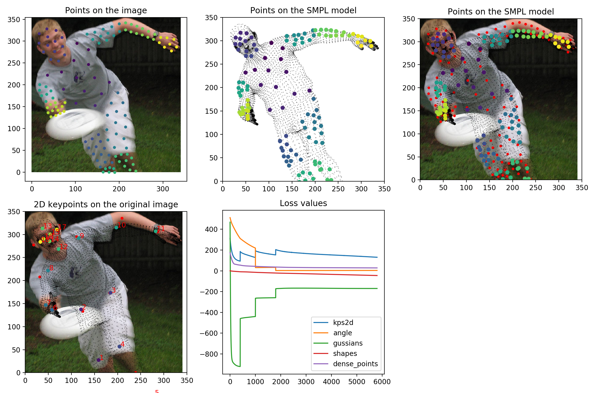

Fitting human [SMPL](http://smpl.is.tue.mpg.de/) model to known keypoints to estimated the human pose and shape (and maybe the distance in picture).

It's mainly based on the paper
["Keep it SMPL: Automatic Estimation of 3D Human Pose and Shape from a Single Image"](https://arxiv.org/abs/1607.08128).
Compare to the [orignal implementation](http://smplify.is.tue.mpg.de/) written by the author of the paper,
this implementation add the information of dense points position which are get from [DensePose](http://densepose.org/) model,
while their model mostly rely on the 19 keypoints 2D position.

The interpenetration error is not used in this implementation,
because the information of dense points position can actually define the shape of body and help avoid generating invalid body shape.

Also, this implementation use tensorflow to construct the model, and minimize the loss by the tensorflow optimizers.

# Result

To be continued...

# Reference
- ["Keep it SMPL: Automatic Estimation of 3D Human Pose and Shape from a Single Image"](https://arxiv.org/abs/1607.08128)
- ["A Skinned Multi-Person Linear Model"](http://smpl.is.tue.mpg.de/)
- [End-to-end Recovery of Human Shape and Pose](https://akanazawa.github.io/hmr/)

